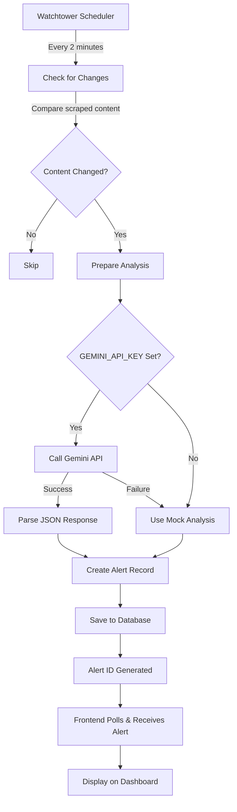
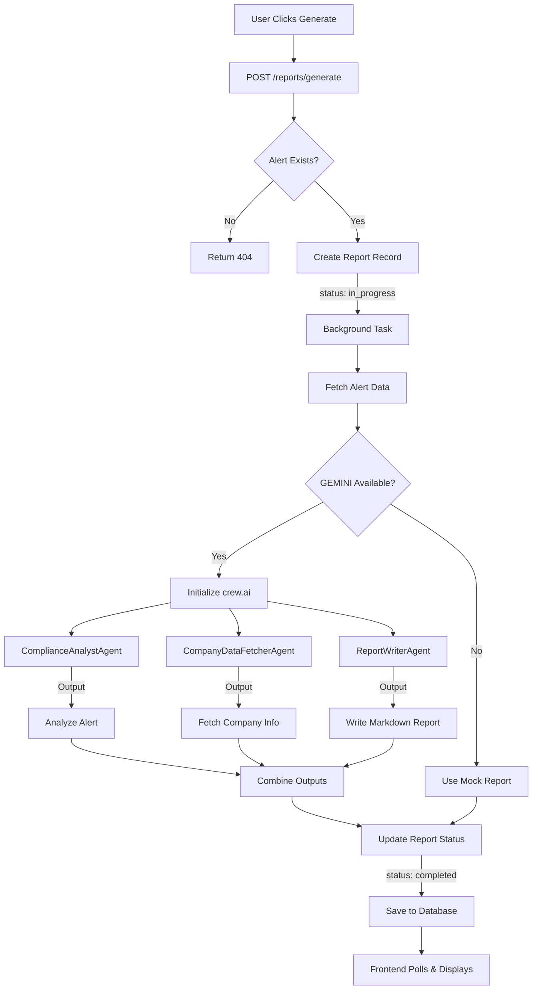
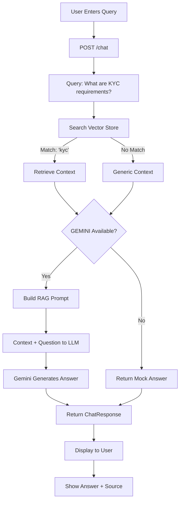
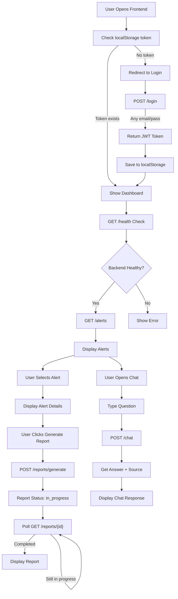

# CompliOps - Complete Application Flow & Documentation

## Table of Contents
1. [User Flow & Sign-Up Process](#user-flow--sign-up-process)
2. [System Architecture Overview](#system-architecture-overview)
3. [Three Core Features](#three-core-features)
4. [Data Flow & Processing](#data-flow--processing)
5. [API Documentation](#api-documentation)
6. [Workflow Diagrams](#workflow-diagrams)
7. [Database Schema](#database-schema)
8. [Error Handling & Fallbacks](#error-handling--fallbacks)

---

## User Flow & Sign-Up Process

### Initial User Journey

```
┌─────────────────────────────────────────────────────────────────┐
│                    COMPLISENSE USER JOURNEY                     │
└─────────────────────────────────────────────────────────────────┘

STEP 1: Landing Page
├─ User visits CompliOps frontend
├─ Sees dashboard with empty state
└─ Presented with two options: Sign Up or Log In

STEP 2: Sign-Up / Login
├─ User enters email and password
├─ Frontend sends POST /api/v1/login
├─ Backend returns mock JWT token (no real DB validation)
└─ User is authenticated and redirected to Dashboard

STEP 3: Dashboard Access
├─ Frontend stores JWT token in localStorage
├─ All subsequent requests include token in headers
├─ User sees three main sections:
│  ├─ Watchtower: Compliance Alerts
│  ├─ Executor: Generated Reports
│  └─ Reliable Chat: AI Q&A
└─ System automatically starts monitoring (Watchtower)

STEP 4: Automatic Monitoring (Watchtower)
├─ Backend scheduler runs every 2 minutes
├─ Checks for regulatory changes
├─ Generates alerts automatically
├─ Frontend polls GET /api/v1/alerts
└─ New alerts appear on dashboard in real-time

STEP 5: Trigger Report Generation
├─ User clicks "Generate Report" on an alert
├─ Frontend sends POST /api/v1/reports/generate?alert_id=1
├─ Backend creates report in "in_progress" status
├─ Background task starts crew.ai analysis
├─ Frontend polls GET /api/v1/reports/{id} for status
└─ Report appears when complete

STEP 6: Chat with AI
├─ User asks compliance question in chat
├─ Frontend sends POST /api/v1/chat
├─ Backend searches mock vector store for context
├─ Returns answer with source attribution
└─ User gets instant compliance guidance

STEP 7: Access Reports & Alerts
├─ User can view all alerts: GET /api/v1/alerts
├─ View specific alert details: GET /api/v1/alerts/{id}
├─ List all reports: GET /api/v1/reports
├─ View full report content: GET /api/v1/reports/{id}
└─ Export or download for compliance records
```

---

## System Architecture Overview

```
┌──────────────────────────────────────────────────────────────────────┐
│                         COMPLIOS SYSTEM ARCHITECTURE                 │
└──────────────────────────────────────────────────────────────────────┘

┌─────────────────────────┐
│   NEXT.JS FRONTEND      │
│  ────────────────────  │
│  - Dashboard            │
│  - Alerts Display       │
│  - Report Viewer        │
│  - Chat Interface       │
└────────────┬────────────┘
             │ HTTP/REST API
             ▼
┌─────────────────────────────────────────────────────────────────────┐
│                        FASTAPI BACKEND                              │
├─────────────────────────────────────────────────────────────────────┤
│                                                                     │
│  ┌──────────────────────────────────────────────────────────────┐ │
│  │                    MAIN APPLICATION                          │ │
│  │  - FastAPI Server (Uvicorn)                                 │ │
│  │  - CORS Configuration                                       │ │
│  │  - Route Registration                                       │ │
│  │  - Lifecycle Management                                     │ │
│  └──────────────────────────────────────────────────────────────┘ │
│                                                                     │
│  ┌─────────────────┐  ┌─────────────────┐  ┌────────────────────┐│
│  │  WATCHTOWER     │  │   EXECUTOR      │  │  RELIABLE CHAT     ││
│  │  (Alerts)       │  │  (Reports)      │  │  (RAG Q&A)         ││
│  │ ────────────────│  │────────────────│  │───────────────────││
│  │ • Background    │  │ • crew.ai       │  │ • Vector Store     ││
│  │   Scheduler     │  │   Agents        │  │ • Query Matching   ││
│  │ • Change        │  │ • Multi-agent   │  │ • Gemini LLM       ││
│  │   Detection     │  │   Orchestration │  │   (or Mock)        ││
│  │ • Real/Mock     │  │ • Real/Mock     │  │ • Real/Mock        ││
│  │   Analysis      │  │   Generation    │  │   Responses        ││
│  └─────────────────┘  └─────────────────┘  └────────────────────┘│
│                                                                     │
│  ┌──────────────────────────────────────────────────────────────┐ │
│  │                    SHARED SERVICES                           │ │
│  │  - Configuration (env vars, LLM setup)                       │ │
│  │  - Database ORM (SQLAlchemy)                                 │ │
│  │  - Pydantic Schemas (validation)                             │ │
│  │  - Error Handling & Logging                                  │ │
│  └──────────────────────────────────────────────────────────────┘ │
│                                                                     │
└─────────────────────────────────────────────────────────────────────┘
             │
             ├──────────────────────────┬──────────────────────────┐
             │                          │                          │
             ▼                          ▼                          ▼
    ┌──────────────────┐      ┌──────────────────┐      ┌──────────────────┐
    │  SQLite Database │      │  Google Gemini   │      │  Configuration   │
    │  ─────────────── │      │  ─────────────── │      │  ─────────────── │
    │  • Users         │      │  • LLM Model     │      │  • API Keys      │
    │  • Alerts        │      │  • Prompts       │      │  • Mock Data     │
    │  • Reports       │      │  • Analysis      │      │  • Settings      │
    └──────────────────┘      └──────────────────┘      └──────────────────┘
```

---

## Three Core Features

### Feature 1: WATCHTOWER (Automated Change Detection)

**Purpose**: Continuously monitors regulatory changes and alerts the compliance team

**How it works**:
1. **Automatic Scheduling**: Runs every 2 minutes via APScheduler
2. **Change Detection**: Simulates web scraping (toggled on even/odd minutes for demo)
3. **Analysis**: Sends detected changes to Gemini API (or mock if no API key)
4. **Storage**: Saves alerts with analysis to SQLite database
5. **Real-time Notification**: Frontend polls for new alerts

**Data Flow**:
```
┌────────────┐
│ Simulator  │ (Every 2 minutes)
└──────┬─────┘
       │
       ▼
┌───────────────────────────────────────┐
│ Check for Change Detection            │
│ (Compare scraped content)             │
└──────┬────────────────────────────────┘
       │
       ├─ No change ─────► Skip
       │
       ▼ (Change detected!)
┌────────────────────────────────┐
│ GEMINI API (if available)      │
│ Analyze: Impact + Actions      │
│ Response: JSON Analysis        │
└──────┬─────────────────────────┘
       │
       ├─ API Error ─────► Use Mock Response
       │
       ▼
┌────────────────────────────────┐
│ Create ComplianceAlert Record  │
│ - summary (change description) │
│ - impact_json (analysis)       │
│ - action_required (bool)       │
│ - created_at (timestamp)       │
└──────┬─────────────────────────┘
       │
       ▼
┌────────────────────────────────┐
│ Save to SQLite Database        │
│ Return Alert ID                │
└────────────────────────────────┘
```

**Example Alert Data**:
```json
{
  "id": 1,
  "source": "watchtower",
  "summary": "SAMA updated consumer protection guidelines on microfinance lending.",
  "impact_json": {
    "impact": "High",
    "actions": [
      "Review compliance documentation",
      "Update internal policies",
      "Notify compliance team immediately"
    ]
  },
  "action_required": true,
  "created_at": "2025-11-15T10:30:00"
}
```

---

### Feature 2: EXECUTOR (AI Report Generation)

**Purpose**: Automatically generates detailed compliance reports from alerts using AI agents

**How it works**:
1. **User Trigger**: User clicks "Generate Report" on an alert
2. **Job Creation**: Report record created in "in_progress" status
3. **Background Processing**: crew.ai orchestrates three agents:
   - **ComplianceAnalystAgent**: Analyzes the alert
   - **CompanyDataFetcherAgent**: Retrieves company metadata
   - **ReportWriterAgent**: Composes comprehensive report
4. **Status Update**: Report saved to database when complete
5. **Real-time Polling**: Frontend retrieves completed report

**Data Flow**:
```
Frontend User
      │
      ▼
POST /api/v1/reports/generate?alert_id=1
      │
      ├─ Validate alert exists
      │
      ├─ Create GeneratedReport
      │  - status: "in_progress"
      │  - alert_id: 1
      │
      ▼
Background Task Initiated
      │
      ├─ Fetch ComplianceAlert from DB
      │
      ├─ GEMINI API Available?
      │
      ├─ YES ─────► Initialize crew.ai Agents
      │             │
      │             ├─ Task 1: Analyze Alert
      │             │           ▼ ComplianceAnalystAgent
      │             │           Returns: Analysis JSON
      │             │
      │             ├─ Task 2: Fetch Company Data
      │             │           ▼ CompanyDataFetcherAgent
      │             │           Returns: Company metadata
      │             │
      │             └─ Task 3: Write Report
      │                         ▼ ReportWriterAgent
      │                         Returns: Markdown content
      │
      ├─ NO ──────► Generate Mock Report
      │             (Realistic hardcoded template)
      │
      ▼
Update GeneratedReport
- status: "completed"
- content_markdown: [full report text]
      │
      ▼
Save to Database
      │
      ▼
Frontend polls GET /api/v1/reports/{report_id}
and displays completed report
```

**Example Report Data**:
```json
{
  "id": 1,
  "alert_id": 1,
  "status": "completed",
  "title": "Compliance Report for Alert #1",
  "content_markdown": "# Compliance Report\n\n## Executive Summary\n...",
  "created_at": "2025-11-15T10:35:00"
}
```

---

### Feature 3: RELIABLE CHAT (RAG-based Compliance Q&A)

**Purpose**: Answers compliance questions using retrieval-augmented generation

**How it works**:
1. **User Query**: User asks a compliance question
2. **Context Retrieval**: Search mock vector store for relevant compliance info
3. **RAG Prompt**: Combine retrieved context with user question
4. **Gemini Response**: Get answer from LLM using context (or mock response)
5. **Attribution**: Return answer with source information

**Data Flow**:
```
User Query: "What are data residency requirements?"
      │
      ▼
Frontend: POST /api/v1/chat
{
  "query": "What are data residency requirements?"
}
      │
      ▼
Backend Search
      │
      ├─ Search mock_vector_store keys
      │  for matching keywords
      │
      ├─ Found match: "data residency"
      │
      ▼
Retrieve Context
      │
      context = "The CBUAE rulebook requires all PII data
                  to be stored within UAE borders..."
      │
      ▼
GEMINI Available?
      │
      ├─ YES ─────► Build RAG Prompt
      │              │
      │              ├─ Context: [compliance text]
      │              ├─ Question: [user query]
      │              ├─ Instruction: Answer using only context
      │              │
      │              ▼ ChatGoogleGenerativeAI.invoke()
      │              Returns: Full answer from LLM
      │              source = "Compliance DB (Key: data residency)"
      │
      ├─ NO ──────► Generate Mock Answer
      │              source = "Mock: DATA_RESIDENCY"
      │
      ▼
Return ChatResponse
{
  "answer": "Based on the CBUAE rulebook...",
  "source": "Compliance DB (Key: data residency)"
}
```

**Mock Vector Store Structure**:
```python
mock_vector_store = {
    "bnpl": "SAMA Circular 123 states that...",
    "data residency": "The CBUAE rulebook requires...",
    "kyc": "Know Your Customer requirements mandate...",
    "aml": "Anti-Money Laundering regulations require..."
}
```

---

## Data Flow & Processing

### Complete Request-Response Cycle

#### Example 1: User Logs In

```
┌─────────────────────────────────────────────────────────────────┐
│                      LOGIN FLOW                                 │
└─────────────────────────────────────────────────────────────────┘

Frontend:
  User enters: email="john@example.com", password="pass123"
       │
       ▼
  POST /api/v1/login
  Content-Type: application/json
  {
    "email": "john@example.com",
    "password": "pass123"
  }
       │
       ▼
Backend (app/routes/auth.py):
  Receives LoginRequest
       │
       ├─ Validate schema (Pydantic)
       │
       ├─ Generate mock token:
       │  mock_token = f"mock_jwt_token_{email}_{timestamp}"
       │
       ▼
  Return LoginResponse:
  {
    "access_token": "mock_jwt_token_john@example.com_1731673200.5",
    "token_type": "bearer"
  }
       │
       ▼
Frontend:
  Save token to localStorage
  Set Authorization header for all future requests
  Redirect to Dashboard
```

#### Example 2: Fetching Alerts

```
┌─────────────────────────────────────────────────────────────────┐
│                   FETCH ALERTS FLOW                             │
└─────────────────────────────────────────────────────────────────┘

Frontend (on Dashboard Load):
  GET /api/v1/alerts?skip=0&limit=10
  Headers: Authorization: "Bearer mock_jwt_token_..."
       │
       ▼
Backend (app/routes/alerts.py):
  Extract query params: skip=0, limit=10
       │
       ├─ Create DB session
       │
       ├─ Query database:
       │  SELECT * FROM compliance_alerts
       │  OFFSET 0 LIMIT 10
       │  ORDER BY created_at DESC
       │
       ├─ Transform to Pydantic (ComplianceAlertResponse)
       │
       ├─ Close DB session
       │
       ▼
  Return array of ComplianceAlertResponse:
  [
    {
      "id": 1,
      "source": "watchtower",
      "summary": "SAMA updated consumer protection...",
      "impact_json": { ... },
      "action_required": true,
      "created_at": "2025-11-15T10:30:00"
    },
    { ... }
  ]
       │
       ▼
Frontend:
  Display alerts on dashboard
  Enable user to click on alerts
  Show alert details
```

---

## API Documentation

### Authentication Endpoints

#### `POST /api/v1/login`

**Request**:
```json
{
  "email": "user@example.com",
  "password": "password123"
}
```

**Response** (200 OK):
```json
{
  "access_token": "mock_jwt_token_user@example.com_1731673200.5",
  "token_type": "bearer"
}
```

**Usage**: Call once during login, store token in localStorage, include in all future requests

---

### Watchtower Endpoints

#### `GET /api/v1/alerts`

**Query Parameters**:
- `skip` (int, default: 0) - Pagination offset
- `limit` (int, default: 10) - Max results per page

**Response** (200 OK):
```json
[
  {
    "id": 1,
    "source": "watchtower",
    "summary": "SAMA updated consumer protection guidelines...",
    "impact_json": {
      "impact": "High",
      "actions": ["Review docs", "Update policies"]
    },
    "action_required": true,
    "created_at": "2025-11-15T10:30:00"
  }
]
```

---

#### `GET /api/v1/alerts/{alert_id}`

**Path Parameters**:
- `alert_id` (int) - The alert ID

**Response** (200 OK):
```json
{
  "id": 1,
  "source": "watchtower",
  "summary": "SAMA updated consumer protection guidelines...",
  "impact_json": { ... },
  "action_required": true,
  "created_at": "2025-11-15T10:30:00"
}
```

**Error Response** (404 Not Found):
```json
{
  "detail": "Alert not found"
}
```

---

### Executor Endpoints

#### `POST /api/v1/reports/generate`

**Query Parameters**:
- `alert_id` (int) - The alert ID to generate report for

**Response** (200 OK):
```json
{
  "report_id": 1,
  "status": "in_progress"
}
```

**Processing**: Report generation happens in background. Frontend should poll the `/api/v1/reports/{report_id}` endpoint

---

#### `GET /api/v1/reports`

**Query Parameters**:
- `skip` (int, default: 0) - Pagination offset
- `limit` (int, default: 10) - Max results per page

**Response** (200 OK):
```json
[
  {
    "id": 1,
    "alert_id": 1,
    "status": "completed",
    "title": "Compliance Report for Alert #1",
    "content_markdown": "# Compliance Report\n\n## Executive Summary\n...",
    "created_at": "2025-11-15T10:35:00"
  }
]
```

---

#### `GET /api/v1/reports/{report_id}`

**Path Parameters**:
- `report_id` (int) - The report ID

**Response** (200 OK):
```json
{
  "id": 1,
  "alert_id": 1,
  "status": "completed",
  "title": "Compliance Report for Alert #1",
  "content_markdown": "# Compliance Report\n...",
  "created_at": "2025-11-15T10:35:00"
}
```

**Response** (200 OK, In Progress):
```json
{
  "id": 1,
  "alert_id": 1,
  "status": "in_progress",
  "title": "Compliance Report for Alert #1",
  "content_markdown": "",
  "created_at": "2025-11-15T10:35:00"
}
```

---

### Reliable Chat Endpoints

#### `POST /api/v1/chat`

**Request**:
```json
{
  "query": "What are data residency requirements?"
}
```

**Response** (200 OK):
```json
{
  "answer": "Based on the CBUAE rulebook, all Personally Identifiable Information (PII) data must be stored within UAE borders unless explicitly approved by the regulator. Data residency compliance is mandatory for all fintech operators.",
  "source": "Compliance DB (Key: data residency)"
}
```

**Mock Response** (No API Key):
```json
{
  "answer": "This is a mock answer. Based on your query, I found this context: The CBUAE rulebook requires all PII data to be stored within UAE borders...",
  "source": "Mock: DATA_RESIDENCY"
}
```

---

### System Endpoints

#### `GET /health`

**Response** (200 OK):
```json
{
  "status": "healthy",
  "timestamp": "2025-11-15T10:40:00.123456",
  "api_key_configured": true,
  "mode": "Production",
  "version": "1.0.0"
}
```

#### `GET /`

**Response** (200 OK):
```json
{
  "message": "CompliOps API",
  "description": "Compliance Automation Platform with Agentic AI",
  "docs": "/docs",
  "health": "/health"
}
```

---

## Workflow Diagrams

### Workflow 1: Complete Watchtower Alert Creation



### Workflow 2: Report Generation with crew.ai



### Workflow 3: Chat Query Processing



### Workflow 4: Complete User Session



---

## Database Schema

### Users Table
```sql
CREATE TABLE users (
    id INTEGER PRIMARY KEY,
    email VARCHAR UNIQUE NOT NULL,
    password_hash VARCHAR NOT NULL,
    created_at DATETIME DEFAULT CURRENT_TIMESTAMP
);
```

### ComplianceAlerts Table
```sql
CREATE TABLE compliance_alerts (
    id INTEGER PRIMARY KEY,
    source VARCHAR DEFAULT 'watchtower',
    summary VARCHAR NOT NULL,
    impact_json JSON NOT NULL,
    action_required BOOLEAN DEFAULT TRUE,
    created_at DATETIME DEFAULT CURRENT_TIMESTAMP
);
```

**Sample Data**:
```json
{
  "id": 1,
  "source": "watchtower",
  "summary": "SAMA updated consumer protection guidelines on microfinance lending.",
  "impact_json": {
    "impact": "High",
    "actions": ["Review compliance documentation", "Update policies"],
    "summary": "SAMA updated consumer protection guidelines on microfinance lending."
  },
  "action_required": true,
  "created_at": "2025-11-15T10:30:00"
}
```

### GeneratedReports Table
```sql
CREATE TABLE generated_reports (
    id INTEGER PRIMARY KEY,
    alert_id INTEGER NOT NULL,
    status VARCHAR DEFAULT 'completed',
    title VARCHAR NOT NULL,
    content_markdown TEXT,
    created_at DATETIME DEFAULT CURRENT_TIMESTAMP
);
```

**Sample Data**:
```json
{
  "id": 1,
  "alert_id": 1,
  "status": "completed",
  "title": "Compliance Report for Alert #1",
  "content_markdown": "# Compliance Report\n\n## Executive Summary\nThis report addresses the compliance alert: SAMA updated consumer protection guidelines...",
  "created_at": "2025-11-15T10:35:00"
}
```

---

## Error Handling & Fallbacks

### Graceful Degradation Strategy

The system is designed to work **without any API keys**:

#### 1. Watchtower Fallback
```python
if GEMINI_API_KEY and llm:
    # Call real Gemini API
    analysis = call_gemini_api(content)
else:
    # Use hardcoded mock analysis
    analysis = {
        "summary": content,
        "impact": "High",
        "action_required": True,
        "actions": [
            "Review compliance documentation",
            "Update internal policies",
            "Notify compliance team immediately"
        ]
    }
```

#### 2. Executor Fallback
```python
if GEMINI_API_KEY and llm:
    # Initialize crew.ai with real LLM
    crew = Crew(agents=[...], tasks=[...], llm=llm)
    result = crew.kickoff()
else:
    # Generate realistic mock Markdown report
    result = generate_mock_executor_report(alert, company_data)
```

#### 3. Chat Fallback
```python
if GEMINI_API_KEY and llm:
    # Call Gemini for RAG answer
    response = llm.invoke(rag_prompt)
    answer = response.content
else:
    # Return mock answer with context
    answer = f"This is a mock answer. Based on your query, I found this context: {context}"
```

### Error Recovery

**Database Errors**:
- Catch and log all database exceptions
- Return 500 with user-friendly message
- Rollback on failure to maintain consistency

**API Errors**:
- Catch Gemini API exceptions
- Fall back to mock responses
- Log error for debugging
- Continue operation without interruption

**Validation Errors**:
- Pydantic validates all requests
- Return 422 with field error details
- Prevents invalid data from entering system

---

## Running the Application

### Setup

```bash
# 1. Install dependencies
pip install fastapi uvicorn sqlalchemy apscheduler google-generativeai crew-ai langchain-google-genai

# 2. Set environment (optional, app works without it)
export GEMINI_API_KEY="your-api-key-here"

# 3. Start server
python main.py
```

### Access Points

- **API Docs**: http://localhost:8000/docs (Interactive Swagger UI)
- **Health Check**: http://localhost:8000/health
- **Backend**: http://0.0.0.0:8000

### Testing Flows

**Test Watchtower**:
```bash
# Wait 2+ minutes for automatic detection, then fetch
curl http://localhost:8000/api/v1/alerts
```

**Test Report Generation**:
```bash
# Get an alert first
curl http://localhost:8000/api/v1/alerts

# Then generate report
curl -X POST "http://localhost:8000/api/v1/reports/generate?alert_id=1"

# Poll for completion
curl http://localhost:8000/api/v1/reports/1
```

**Test Chat**:
```bash
curl -X POST http://localhost:8000/api/v1/chat \
  -H "Content-Type: application/json" \
  -d '{"query": "What are data residency requirements?"}'
```

---

## Key Takeaways

1. **Modular Architecture**: Three independent features working together
2. **Mock-First Design**: Fully functional without external APIs
3. **Background Processing**: crew.ai and APScheduler handle heavy lifting
4. **RAG Implementation**: Simple but effective vector store + LLM
5. **Real-time UX**: Frontend polling for status updates
6. **Error Resilience**: Graceful fallbacks at every level
7. **Production Ready**: Logging, error handling, database transactions

